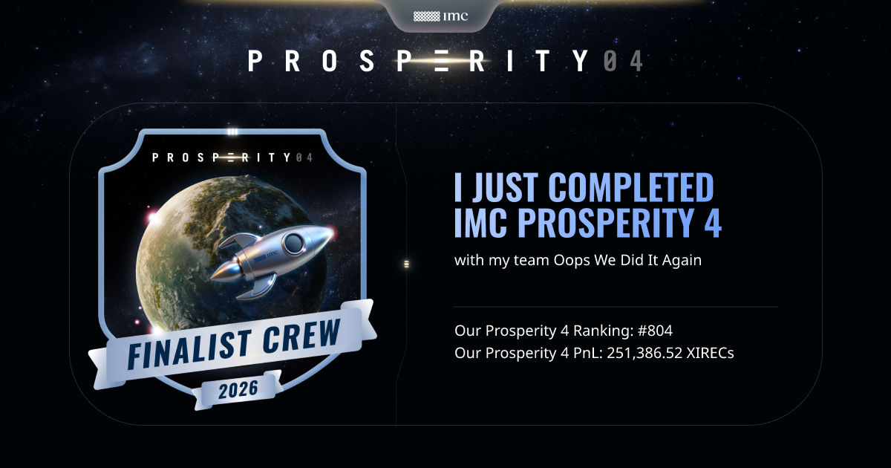
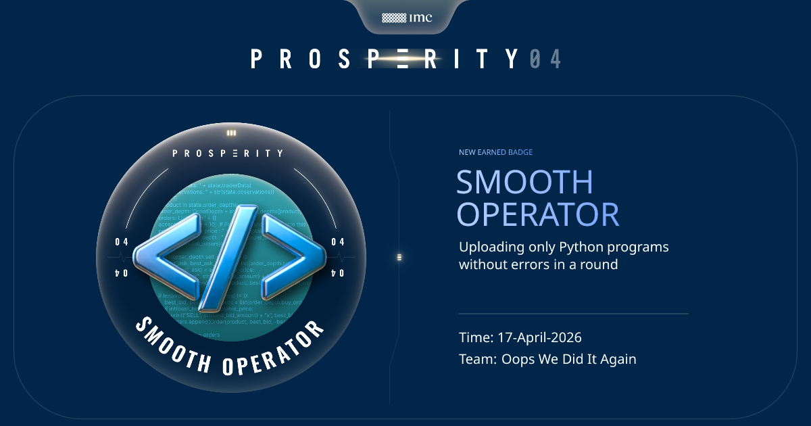
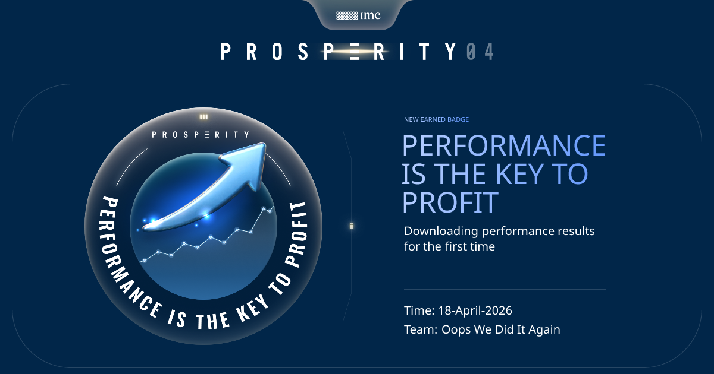
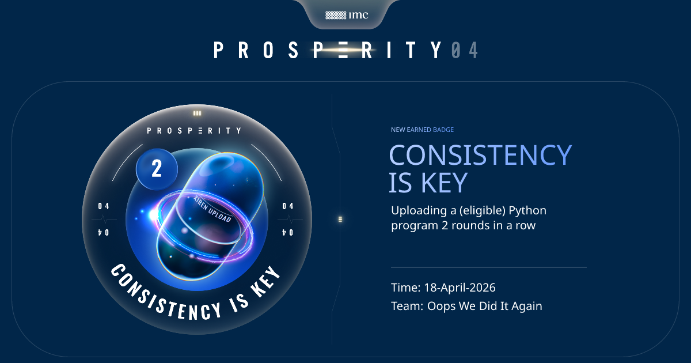
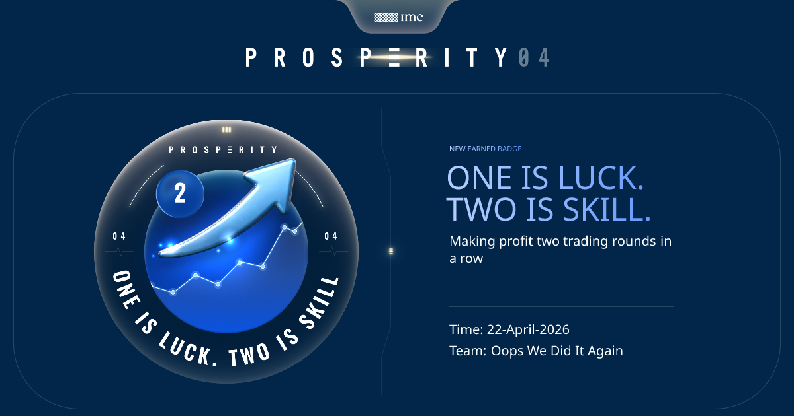

# 🚀 IMC Prosperity 4 Algorithmic Trading Challenge


A Python-based algorithmic trading project built for **IMC Prosperity 4**, a multi-round simulated trading competition. I was responsible for the algorithmic challenges: analyzing the supplied historical market databases, identifying product relationships, building fair-value models, managing inventory risk, and submitting round-by-round `Trader` implementations.

I competed with my team **Oops We Did It Again** and finished:

| Result | Placement |
|---|---:|
| **Overall rank** | **804 / 3,648 teams** |
| **Algorithmic rank** | **474 / 3,648 teams** |
| **USA rank** | **214** |
| **Final PnL** | **251,386.52 XIRECs** |
| **Overall percentile** | Top **22.0%** |
| **Algorithmic percentile** | Top **13.0%** |



---

## ✨ Project Highlights

- 📈 **Multi-round trading system** — Final Python algorithms for all 5 Prosperity rounds
- 🧮 **Fair-value modeling** — Mid-price, microprice, EMA, regression, volatility-smile, and PCA-based estimates
- 🏦 **Market making** — Inventory-aware bid/ask placement around fair value
- ⚡ **Liquidity taking** — Aggressive execution when visible prices crossed model thresholds
- 🧠 **Stateful strategy design** — Used `traderData` to preserve price history, signals, cash estimates, and risk state
- 🧾 **Options pricing** — Modeled Velvetfruit Extract vouchers with Black-Scholes-style pricing and implied-volatility structure
- 👥 **Counterparty-aware signals** — Used disclosed Round 4 trader IDs to shift fair values based on observed participant behavior
- 🧩 **Cross-sectional modeling** — Used PCA/QAPCA-style reconstruction for Round 5’s 50-product universe
- 🛡️ **Risk controls** — Position clamps, inventory skew, reduce-only modes, drawdown locks, and selective product disabling

---

## 🏅 Selected Competition Badges

These are the badges most relevant to the project as a software and trading portfolio piece.

<table>
  <tr>
    <td align="center"><br><b>Smooth Operator</b><br>Submitted Python programs without errors.</td>
    <td align="center"><br><b>Performance Is the Key to Profit</b><br>Downloaded and analyzed performance results.</td>
  </tr>
  <tr>
    <td align="center"><br><b>Consistency Is Key</b><br>Uploaded eligible Python programs across rounds.</td>
    <td align="center"><br><b>One Is Luck. Two Is Skill.</b><br>Generated profit in consecutive trading rounds.</td>
  </tr>
  <tr>
    <td align="center" colspan="2"><br><b>Go Big or Go Home</b><br>Unlocked a large outpost building during the competition.</td>
  </tr>
</table>

---

## 🛠️ Tech Stack

| Component | Technology / Method |
|---|---|
| **Language** | Python 3 |
| **Core interface** | IMC Prosperity `Trader` class and `datamodel.py` objects |
| **Market data** | CSV order-book and trade-history files |
| **Data analysis** | pandas, NumPy, Python scripts/notebooks |
| **Trading methods** | Market making, liquidity taking, pair/relative-value trading |
| **Modeling methods** | EMA, microprice, linear regression, option pricing, volatility-smile fitting, PCA/QAPCA |
| **Risk management** | Position limits, inventory skew, drawdown locks, reduce-only modes |

---

## 🧠 How the Project Works

Each round of IMC Prosperity introduced a new market setting, product universe, or additional market mechanic. The workflow was:

```text
Read round instructions
        │
        ▼
Inspect supplied price and trade databases
        │
        ▼
Search for product structure, fair values, trends, spreads, and anomalies
        │
        ▼
Build a round-specific Trader algorithm
        │
        ▼
Backtest / submit / inspect logs and PnL
        │
        ▼
Refine execution thresholds and risk controls
        │
        ▼
Submit final round algorithm
```

The project is organized so that every final submitted algorithm is available in `algorithms/`, while every round has a dedicated README explaining what the algorithm actually does.

---

## 📊 Round-by-Round Strategy Summary

| Round | Products / Setting | Main Strategy |
|---|---|---|
| **Round 1** | `ASH_COATED_OSMIUM`, `INTARIAN_PEPPER_ROOT` | Fair-value market making with inventory skew and aggressive takes when prices moved too far from fair value |
| **Round 2** | Same products + Market Access Fee | Stateful forecasting, microprice/EMA fair values, improved inventory handling, and a `bid()` function for extra market access |
| **Round 3** | `HYDROGEL_PACK`, `VELVETFRUIT_EXTRACT`, VEV vouchers | Delta-one anchored trading plus Black-Scholes-style option pricing and volatility-smile estimates |
| **Round 4** | Same as Round 3 + counterparty IDs | Added Mark/counterparty-based signals, faster flow indicators, and updated voucher/underlying fair-value shifts |
| **Round 5** | 50 new products across 10 categories | Pebbles relative value, Snack Pack relationships, jump-fade modules, and PCA/QAPCA fair-value reconstruction |

---

## 📚 Round READMEs

Each round README follows the same portfolio-style format: instructions, products, data used, strategy flow, algorithm behavior, risk controls, and files.

| Round | README | Submitted Algorithm |
|---|---|---|
| Round 1 — Trading Groundwork | [`rounds/round_1/README.md`](rounds/round_1/README.md) | [`algorithms/round_1_trader.py`](algorithms/round_1_trader.py) |
| Round 2 — Growing Your Outpost | [`rounds/round_2/README.md`](rounds/round_2/README.md) | [`algorithms/round_2_trader.py`](algorithms/round_2_trader.py) |
| Round 3 — Gloves Off | [`rounds/round_3/README.md`](rounds/round_3/README.md) | [`algorithms/round_3_trader.py`](algorithms/round_3_trader.py) |
| Round 4 — The More the Merrier | [`rounds/round_4/README.md`](rounds/round_4/README.md) | [`algorithms/round_4_trader.py`](algorithms/round_4_trader.py) |
| Round 5 — The Final Stretch | [`rounds/round_5/README.md`](rounds/round_5/README.md) | [`algorithms/round_5_trader.py`](algorithms/round_5_trader.py) |

---

## 🔍 Algorithms Explained

### 1. Fair-Value Market Making

The early rounds focused on estimating fair value for each product and quoting around that estimate.

For a product with fair value `F`, the algorithm places a bid below fair and an ask above fair:

```text
bid = fair - edge - inventory_skew
ask = fair + edge - inventory_skew
```

Inventory skew shifts quotes based on current position. If the algorithm is already long, it becomes less aggressive on the bid and more willing to sell. If it is short, it does the opposite.

### 2. Aggressive Liquidity Taking

When visible order-book prices were sufficiently mispriced, the algorithms crossed the spread instead of waiting passively.

```text
if best_ask < fair - threshold:
    buy

if best_bid > fair + threshold:
    sell
```

This was used for products where the expected edge was large enough to justify paying the spread.

### 3. Stateful Forecasting

Starting in Round 2, the algorithm used saved `traderData` to preserve rolling histories and internal state between timestamps.

The strategy used:

- rolling mid-price history,
- exponential moving averages,
- microprice from top-of-book volume imbalance,
- linear-regression forecasts,
- and serialized memory with size protection.

### 4. Option and Voucher Pricing

Rounds 3 and 4 introduced Velvetfruit Extract vouchers with different strike prices. The algorithm treated the vouchers as call-option-like instruments.

The core idea was:

```text
underlying price + strike + time to expiry + implied volatility
        │
        ▼
model voucher fair value
        │
        ▼
compare market price vs model fair value
        │
        ▼
buy cheap vouchers / sell expensive vouchers
```

The model used a fitted volatility smile with strike-specific adjustments, then traded when the voucher market was far enough from theoretical value.

### 5. Counterparty-Aware Fair Value

Round 4 added visible buyer and seller IDs. The algorithm used those IDs to create product-level signal shifts.

```text
observed trade buyer/seller
        │
        ▼
lookup product-specific Mark alpha
        │
        ▼
decay signal over time
        │
        ▼
shift fair value and quote placement
```

This let the strategy react differently depending on which counterparty appeared in the market.

### 6. Round 5 Cross-Sectional Modeling

Round 5 replaced all previous products with a 50-product universe. The final algorithm combined multiple signal modules:

- **Pebbles module** — exploited the discovered relationship among Pebble products
- **Snack Pack module** — traded relative-value relationships among Snack Pack pairs
- **Jump-fade module** — faded sharp ±100-style jumps in selected products
- **Oxygen microfade module** — handled short-horizon reversal behavior in Oxygen products
- **QAPCA module** — reconstructed fair values across all 50 products using PCA-style cross-sectional relationships
- **Market-maker module** — added conservative quotes where the stronger signals were not active

---

## 📂 Project Structure

```text
imc-prosperity-4/
├── README.md
├── LICENSE
├── requirements.txt
├── .gitignore
│
├── algorithms/
│   ├── round_1_trader.py
│   ├── round_2_trader.py
│   ├── round_3_trader.py
│   ├── round_4_trader.py
│   └── round_5_trader.py
│
├── rounds/
│   ├── round_1/
│   │   └── README.md
│   ├── round_2/
│   │   └── README.md
│   ├── round_3/
│   │   └── README.md
│   ├── round_4/
│   │   └── README.md
│   └── round_5/
│       └── README.md
│
├── docs/
│   ├── INDEX.md
│   ├── round_instructions.md
│   ├── strategy_overview.md
│   └── round_5_pattern_discovery.md
│
├── sources/
│   ├── README.md
│   ├── round_1/
│   ├── round_2/
│   ├── round_3/
│   ├── round_4/
│   └── round_5/
│
├── scripts/
│   └── summarize_sources.py
│
├── notebooks/
│   └── .gitkeep
│
└── assets/
    ├── media/
    │   └── final-score.png
    └── badges/
        ├── smooth-operator.png
        ├── performance-key-profit.png
        ├── consistency-is-key.png
        ├── one-is-luck-two-is-skill.png
        └── go-big-or-go-home.png
```

---

## ⚙️ Getting Started

### Prerequisites

- Python 3.9+
- `pip`
- Optional: Jupyter or another notebook environment for data exploration

### Installation

1. **Clone the repository**

   ```bash
   git clone https://github.com/your-username/imc-prosperity-4.git
   cd imc-prosperity-4
   ```

2. **Create a virtual environment**

   ```bash
   python3 -m venv .venv
   source .venv/bin/activate      # Windows: .venv\Scripts\activate
   ```

3. **Install dependencies**

   ```bash
   python -m pip install --upgrade pip
   python -m pip install -r requirements.txt
   ```

---

## ▶️ Usage

### View a submitted algorithm

```bash
cat algorithms/round_5_trader.py
```

### Summarize supplied source files

```bash
python scripts/summarize_sources.py
```

### Read a round-specific strategy explanation

```text
rounds/round_1/README.md
rounds/round_2/README.md
rounds/round_3/README.md
rounds/round_4/README.md
rounds/round_5/README.md
```

### Important simulator note

The `Trader` classes are designed for the IMC Prosperity simulator. They depend on IMC’s competition-specific `datamodel.py`, including objects such as:

```text
TradingState
OrderDepth
Order
Trade
```

Because of that, the algorithms are best read as competition submissions and portfolio documentation rather than as standalone trading bots.

---

## 📄 Data Sources

The `sources/` folder contains the public market data supplied during the competition. These include price and trade CSV files grouped by round.

Examples:

```text
sources/round_1/prices_round_1_day_-2.csv
sources/round_1/trades_round_1_day_0.csv
sources/round_3/prices_round_3_day_2.csv
sources/round_4/prices_round_4_day_3.csv
```

The historical databases were used to estimate fair values, inspect spreads, identify product relationships, and tune trading thresholds.

---

## 🌱 Future Improvements

- [ ] Add cleaned Jupyter notebooks showing the Round 5 pattern-discovery process
- [ ] Add charts for PnL curves and product relationships
- [ ] Add a lightweight local simulator wrapper for easier testing outside the platform
- [ ] Add unit tests for fair-value and risk-control helper functions
- [ ] Create a short technical report explaining the final Round 5 PCA/QAPCA model
- [ ] Add a visual dashboard summarizing each round’s trades and final positions

---

## 📜 License

The code I wrote in this repository is licensed under the **MIT License**.

Competition statements, product names, datasets, logs, score media, badges, and IMC Prosperity visuals are included only for documentation and educational context. They remain the property of their respective owners.

---

## 👩‍💻 About Me

Built by **Carlota Arzúa** — algorithmic trading, mathematical modeling, optimization, and applied Python.

- 💼 [LinkedIn](https://www.linkedin.com/in/carlota-a-53a75b206/)
- 📧 carlotaarzua@gmail.com
